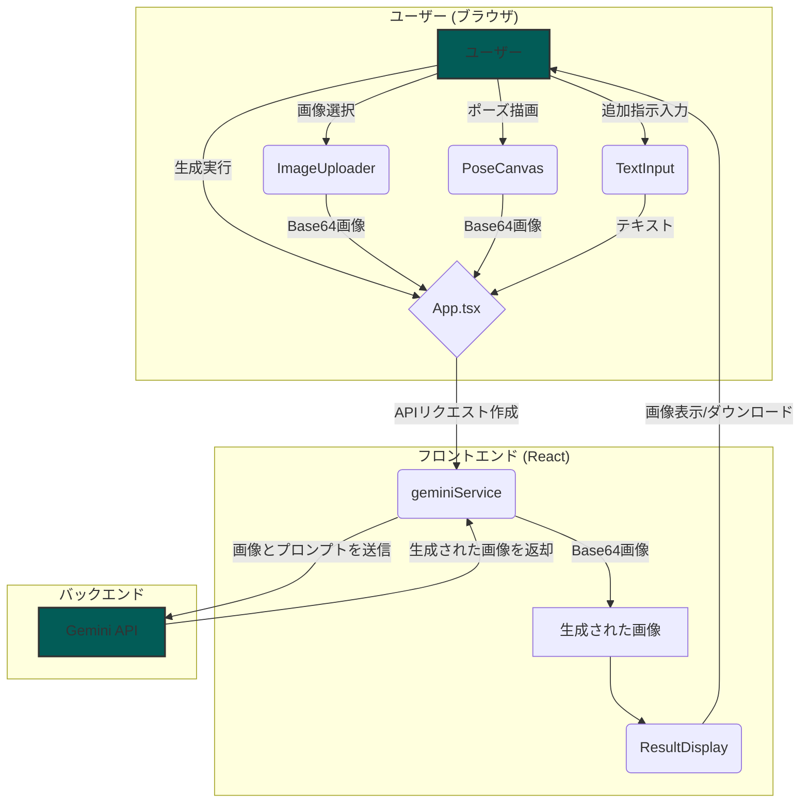

# Nano Banana ポーズチェンジャー

<div align="center">

</div>

**Nano Banana ポーズチェンジャー**は、AIの力を使ってキャラクターのイラストのポーズを自由に変更できるWebアプリケーションです。お気に入りのキャラクターの画像をアップロードし、新しいポーズを棒人間で描くだけで、AIが自然なポーズの画像を生成します。

## ✨ 機能

- **簡単な画像アップロード**: ポーズを変更したいキャラクターの画像をドラッグ＆ドロップまたはファイル選択で簡単にアップロードできます。
- **直感的なポーズ指定**: キャンバスに棒人間を描くだけで、希望のポーズを直感的に指定できます。
- **追加指示**: 「笑顔で」「驚いた表情で」のように、テキストで表情や細かいニュアンスを追加で指示することが可能です。
- **AIによる画像生成**: Googleの最新AIモデル「Gemini」を利用して、高品質な画像を生成します。
- **結果のプレビューとダウンロード**: 生成された画像はすぐにプレビューでき、気に入ったものはPNG形式でダウンロードできます。

## 📝 システム構成図



## 🛠️ 使用技術

- **フロントエンド**: React, TypeScript, Vite, Tailwind CSS
- **AIモデル**: Google Gemini 2.5 Flash (Image Preview)

## 🚀 使い方

1.  **キャラクター画像のアップロード**: 「1. キャラクター画像」エリアに、ポーズを変更したい画像をアップロードします。
2.  **ポーズの指定**:
    - 「2. ポーズの指定」エリアのキャンバスに、棒人間でキャラクターに取らせたいポーズを描きます。
    - 必要であれば、下のテキストボックスに表情などの追加指示を入力します。
3.  **生成**: 画面下部の「ポーズを生成」ボタンをクリックします。
4.  **確認とダウンロード**: 「3. 生成結果」エリアに新しいポーズの画像が表示されます。画像にマウスカーソルを合わせると表示されるダウンロードボタンから、画像を保存できます。

## ⚙️ ローカルでの実行方法

**前提条件:**
- [Node.js](https://nodejs.org/) がインストールされていること。

1.  **リポジトリをクローン**:
    ```bash
    git clone https://github.com/your-username/nano-banana-pose-changer.git
    cd nano-banana-pose-changer
    ```

2.  **依存関係をインストール**:
    ```bash
    npm install
    ```

3.  **APIキーの設定**:
    プロジェクトのルートに `.env` ファイルを作成し、お持ちのGemini APIキーを設定します。(Google ai studioの無料KEYだとエラーとなります。有料アカウントKEYを用意必要です)

    ```
    API_KEY=YOUR_GEMINI_API_KEY
    ```

4.  **開発サーバーを起動**:
    ```bash
    npm run dev
    ```

    ブラウザで `http://localhost:5173` （またはターミナルに表示されたアドレス）にアクセスすると、アプリケーションが表示されます。
